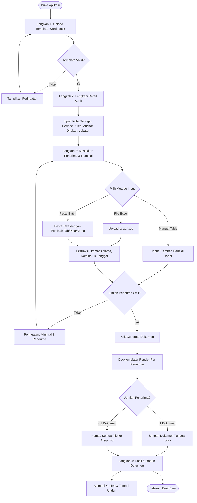

# System Design & Architecture Specification
## Generator Konfirmasi Piutang (KAP Kuncara Budi Santosa dan Rekan)

---

## 1. Ringkasan Eksekutif (Executive Summary)

**Generator Konfirmasi Piutang** adalah aplikasi web modern berbasis *Single Page Application* (SPA) yang dirancang khusus untuk memfasilitasi Kantor Akuntan Publik (KAP) dalam membuat surat konfirmasi piutang audit secara massal (*batch document generation*).

Aplikasi ini beroperasi **100% pada sisi klien (*client-side only*)**, menjamin kerahasiaan data finansial audit klien tanpa pernah mengirim data ke server pihak ketiga.

### 1.1 Masalah yang Diselesaikan
- **Inefisiensi Manual:** Pembuatan surat konfirmasi piutang satu per satu dengan Microsoft Word memakan waktu berjam-jam untuk klien dengan puluhan hingga ratusan debitur.
- **Risiko *Human Error*:** Kesalahan pengetikan nominal saldo piutang, nama debitur, periode audit, dan format tanggal yang inkonsisten.
- **Kerahasiaan Data (KAP Privacy):** Data debitur dan saldo utang-piutang adalah rahasia audit sensitif yang tidak boleh diunggah ke *cloud backend* sembarangan.

### 1.2 Solusi & Keunggulan
- ⚡ **Otomatisasi Multi-Format:** Mampu membaca data debitur dan nominal dari file Excel (`.xlsx`/`.xls`) maupun *copy-paste* teks multibaris.
- 🔒 **Zero Data Leakage:** Seluruh pemrosesan Word, Excel, dan pengemasan ZIP berlangsung dalam memori peramban (*in-memory*).
- 📑 **Integrasi Dinamis Template Word:** Menggunakan template `.docx` asli dengan placeholder tag cerdas (`{{Nama_Penerima}}`, `{{nominal}}`, `{{Periode}}`, dll.).
- 🇮🇩 **Standar Akuntansi Indonesia:** Otomasi format Rupiah (`Rp 15.000.000`) dan format tanggal bahasa Indonesia (`1 Januari 2025`).

---

## 2. Arsitektur Sistem & Tumpukan Teknologi (Technology Stack)

```
+-----------------------------------------------------------------------+
|                             USER BROWSER                              |
+-----------------------------------------------------------------------+
|  +---------------------+   +---------------------+   +--------------+ |
|  |     React 19 UI     |   |   State & Events    |   |  Animations  | |
|  |   (Step Wizard)     |---|   (Form & Data)     |---|    Motion    | |
|  +---------------------+   +---------------------+   +--------------+ |
|             |                         |                               |
|  +---------------------+   +---------------------+                    |
|  |   SheetJS (xlsx)    |   |    docxtemplater    |                    |
|  | (Excel Data Parser) |   | (Template Engine)   |                    |
|  +---------------------+   +---------------------+                    |
|                                       |                               |
|                            +---------------------+                    |
|                            |    PizZip & JSZip   |                    |
|                            | (Archive Packaging) |                    |
|                            +---------------------+                    |
|                                       |                               |
|                            +---------------------+                    |
|                            |     File-Saver      |                    |
|                            |  (Browser Download) |                    |
|                            +---------------------+                    |
+-----------------------------------------------------------------------+
```

### 2.1 Spesifikasi Komponen & Pustaka

| Kategori | Pustaka / Teknologi | Versi | Peran & Alasan Pemilihan |
| :--- | :--- | :--- | :--- |
| **Core Framework** | React | `^19.2.5` | Arsitektur komponen reaktif, rendering performa tinggi, dan declarative UI. |
| **Build & Dev Tool** | Vite | `^8.0.10` | *Bundler* ultra cepat dengan *Hot Module Replacement* (HMR) dan optimasi produksi. |
| **Document Engine** | `docxtemplater` | `^3.68.6` | Parser & template engine manipulasi dokumen OpenXML Word (.docx) berbasis token `{{...}}`. |
| **Zip Manipulation** | `pizzip` & `jszip` | `^3.2.0` / `^3.10.1` | Dekompresi struktur `.docx` (PizZip) dan pengarsipan batch file ke dalam arsip `.zip` (JSZip). |
| **Spreadsheet Parser**| `xlsx` (SheetJS) | `^0.18.5` | Parser file Excel client-side dengan deteksi cell date and numeric formatting. |
| **File Downloader** | `file-saver` | `^2.0.5` | Trigger download file blob (.docx atau .zip) langsung di peramban pengguna. |
| **UI Motion & FX** | `motion` (Framer) & `@formkit/auto-animate` | `^12.40.0` / `^0.9.0` | Transisi halaman mulus, animasi micro-interaction, dan animasi layout daftar interaktif. |
| **Visual Delight** | `react-confetti` & `react-use` | `^6.4.0` / `^17.6.1` | Efek konfeti perayaan saat pembuatan dokumen selesai dan deteksi dimensi layar responsif. |

---

## 3. Diagram Alur Sistem (System Flow Diagrams)

### 3.1 Alur Kerja Pengguna (User Flow Wizard)



---

### 3.2 Pipeline Ekstraksi Data Excel & Teks Batch

```mermaid
flowchart LR
    subgraph Data Input
        EXCEL[File Excel .xlsx/.xls]
        TEXT[Teks Copy-Paste]
    end

    subgraph Smart Parser
        EXCEL --> |XLSX.read cellDates:true| SCAN_KEYS[Deteksi Header Kolom]
        SCAN_KEYS --> |Keyword: nama, debitur, klien| NAME_COL[Nama Penerima]
        SCAN_KEYS --> |Keyword: nominal, saldo, piutang| NOM_COL[Nominal Piutang]
        SCAN_KEYS --> |Keyword: tanggal, periode, tempo| DATE_COL[Format Tanggal]

        TEXT --> |Split Baris & Pemisah: \t, |, ;, ,| PARSE_LINE[Regex Parser]
        PARSE_LINE --> NAME_COL
        PARSE_LINE --> NOM_COL
    end

    subgraph Normalization Engine
        NOM_COL --> |formatRupiah| NORM_MONEY[Rp XX.XXX.XXX]
        DATE_COL --> |formatIndonesianDate| NORM_DATE[DD Bulan YYYY]
    end

    subgraph State Table
        NAME_COL --> REC_STATE[State: recipients array]
        NORM_MONEY --> REC_STATE
        NORM_DATE --> FORM_STATE[State: formData]
    end
```

---

## 4. Struktur Data & Skema State (Data Schema)

### 4.1 Skema State Formulir (`formData`)

```typescript
interface FormData {
  Kota: string;                // Contoh: "Samarinda"
  Tanggal_Konfirmasi: string;  // Contoh: "2025-01-01" -> diformat: "1 Januari 2025"
  Periode: string;             // Contoh: "31 Desember 2024"
  Nama_Klien: string;          // Contoh: "PT Mahakam Berjaya Abadi"
  Sebutan1: string;            // Contoh: "Bpk"
  Auditor1: string;            // Contoh: "Rama Budi, S.Ak."
  Sebutan2: string;            // Contoh: "Ibu"
  Auditor2: string;            // Contoh: "Siti Rahmawati, S.E."
  Tanggal_Jatuh_Tempo: string; // Contoh: "2025-02-15" -> diformat: "15 Februari 2025"
  Nama_Direktur: string;       // Contoh: "H. Bambang Sutrisno"
  Jabatan: string;             // Contoh: "Direktur Utama"
  Nominal_Default: string;     // Contoh: "Rp 10.000.000" (Fallback jika baris kosong)
}
```

### 4.2 Skema Data Penerima (`recipients`)

```typescript
interface Recipient {
  id: string;        // UUID / Unique Timestamp string
  name: string;      // Nama Perusahaan / Debitur
  nominal: string;   // Nilai saldo piutang (Format: Rp XX.XXX.XXX)
}
```

### 4.3 Matriks Pemetaan Tag Template Word (`docData`)

Untuk memastikan kompatibilitas penuh dengan berbagai penulisan tag pada template `.docx`, objek data yang dirender memetakan seluruh varian berikut:

| Kategori Data | Tag Placeholder yang Didukung | Format Nilai Output |
| :--- | :--- | :--- |
| **Nama Debitur** | `{{Nama_Penerima}}`, `{{nama_penerima}}`, `{{NAMA_PENERIMA}}` | Teks Nama Bersih (contoh: `PT Sumber Makmur`) |
| **Nominal Piutang** | `{{nominal}}`, `{{Nominal}}`, `{{NOMINAL}}`, `{{nominal_piutang}}`, `{{Nominal_Piutang}}`, `{{saldo}}`, `{{Saldo}}`, `{{jumlah}}`, `{{Jumlah}}` | Format Rupiah (contoh: `Rp 250.000.000`) |
| **Tanggal Surat** | `{{Tanggal_Konfirmasi}}`, `{{tanggal_konfirmasi}}`, `{{Tanggal}}`, `{{tanggal}}` | Format Tanggal Indo (contoh: `1 Januari 2025`) |
| **Periode Audit** | `{{Periode}}`, `{{periode}}`, `{{PERIODE}}` | Format Tanggal/Teks (contoh: `31 Desember 2024`) |
| **Batas Tempo** | `{{Tanggal_Jatuh_Tempo}}`, `{{tanggal_jatuh_tempo}}`, `{{Jatuh_Tempo}}`, `{{jatuh_tempo}}` | Format Tanggal Indo (contoh: `15 Februari 2025`) |
| **Identitas Klien** | `{{Nama_Klien}}`, `{{Nama_Direktur}}`, `{{Jabatan}}`, `{{Kota}}` | Nilai string dari formulir |
| **Auditor KAP** | `{{Sebutan1}}`, `{{Auditor1}}`, `{{Sebutan2}}`, `{{Auditor2}}` | Nilai string (dikosongkan jika tidak diisi) |

---

## 5. Spesifikasi Desain Antarmuka & UX (UI/UX Specifications)

### 5.1 Identitas Visual & Palet Warna (Brand Tokens)

Aplikasi mengusung tema warna korporat akuntansi modern berbasis gradien *Emerald & Teal*, memancarkan kesan terpercaya, rapi, dan profesional.

```css
:root {
  /* Brand Gradient Colors */
  --grad-1: #10b981; /* Emerald Primary */
  --grad-2: #0d9488; /* Teal Secondary */
  --grad-3: #0a9e90; /* Cyan-Teal Deep */
  --grad-4: #059669; /* Emerald Dark */

  /* Step Indicator Colors */
  --step-1: #10b981;
  --step-2: #0d9488;
  --step-3: #047857;

  /* Surfaces & Typography */
  --card-bg: rgba(255, 255, 255, 0.96);
  --input-bg: #f7f8fc;
  --input-border: #e2e8f0;
  --input-focus: #10b981;
  --text-dark: #1a1a2e;
  --text-muted-dark: #4a5568;
}
```

### 5.2 Komponen Antarmuka Utama

1. **Animated Mesh Gradient Canvas:**
   Latar belakang bergerak dinamis menggunakan animasi CSS `gradientShift 12s ease infinite` untuk estetika visual yang modern.
2. **Glassmorphism Main Card:**
   Kartu formulir utama dilengkapi `backdrop-filter: blur(20px)`, batas semi-transparan `rgba(255,255,255,0.65)`, dan bayangan berlapis untuk kedalaman dimensi.
3. **Step Wizard & Progress Breadcrumbs:**
   Indikator langkah (1: Template $\to$ 2: Detail Audit $\to$ 3: Penerima & Nominal $\to$ 4: Selesai) dengan animasi *spring* dan status centang otomatis.
4. **Interactive Recipient Table:**
   Tabel data dengan *sticky header*, input *dense*, validasi angka realtime dengan warna aksen hijau `#047857`, serta transisi penambahan/penghapusan baris menggunakan `@formkit/auto-animate`.

---

## 6. Penanganan Kasus Khusus & Keamanan (Security & Edge Cases)

### 6.1 Keamanan & Privasi
- **Zero Backend Transmission:** Tidak ada endpoint API eksternal yang menerima data klien. Seluruh siklus hidup data (unggah, parsing, render, unduh) selesai di memori browser.
- **XSS & Injection Protection:** Tidak menggunakan `dangerouslySetInnerHTML`. Tag Word diproses melalui engine Docxtemplater yang meng-escape karakter XML secara ketat.

### 6.2 Sanitasi Nama File Dokumen
Karakter yang dilarang pada sistem operasi Windows/Linux/macOS (`/ \ ? % * : | " < >`) dibersihkan secara otomatis saat penamaan file:
```javascript
const safeRecipientName = rec.name.replace(/[/\\?%*:|"<>]/g, '-').trim() || `Penerima-${index + 1}`;
```

### 6.3 Penanganan Tag Kosong (Placeholder Fallback)
Jika pengguna mengosongkan suatu kolom opsional:
- Field umum: dipertahankan sebagai `{{Tag}}` agar terlihat di Word untuk ditinjau manual.
- Field sebutan auditor (`Sebutan1`/`Sebutan2`): otomatis diubah menjadi string kosong `""` agar tidak menghasilkan teks kurung kurawal ganda pada dokumen akhir.

---

## 7. Struktur Direktori Proyek (Project Structure)

```
konfirmasi-piutang-app/
├── dist/                           # Output Build Produksi (Vite)
├── graphify-out/                   # Knowledge Graph & Laporan Kode (Graphify)
│   ├── graph.json                  # Data Node & Hubungan Graf
│   ├── graph.html                  # Visualisasi Interaktif Browser
│   └── GRAPH_REPORT.md             # Audit Report Arsitektur Proyek
├── public/                         # Aset Statis Publik
│   ├── bahan/
│   │   └── Konfirmasi-Piutang-Template.docx  # Template Word Standar
│   ├── favicon.svg
│   └── icons.svg
├── src/
│   ├── assets/                     # Aset Gambar & Logo KAP
│   │   ├── hero.png
│   │   ├── logo.png
│   │   └── logo_transparan.png     # Logo KAP Header
│   ├── App.css                     # Desain Sistem & Gaya UI Terpadu
│   ├── App.jsx                     # Komponen Logika Utama & State Wizard
│   ├── index.css                   # Reset Dasar & Font Inter
│   └── main.jsx                    # Entry Point React 19
├── design.md                       # Dokumen Spesifikasi Desain & Arsitektur
├── eslint.config.js                # Konfigurasi Linter
├── index.html                      # Bootstrap HTML
├── package.json                    # Dependensi & Skrip NPM
└── vite.config.js                  # Konfigurasi Build Vite
```

---

## 8. Panduan Penggunaan & Pemeliharaan (Maintenance Guide)

### 8.1 Menjalankan Server Pengembangan
```bash
npm install
npm run dev
```

### 8.2 Membangun untuk Produksi
```bash
npm run build
npm run preview
```

### 8.3 Pembaruan Knowledge Graph (Graphify)
Untuk memperbarui graf arsitektur dan dependensi proyek secara otomatis:
```powershell
& (Get-Content graphify-out\.graphify_python) -m graphify export html
```

---

*Dokumen ini disusun sebagai pedoman arsitektur dan pengembangan resmi proyek Generator Konfirmasi Piutang KAP Kuncara Budi Santosa dan Rekan.*

